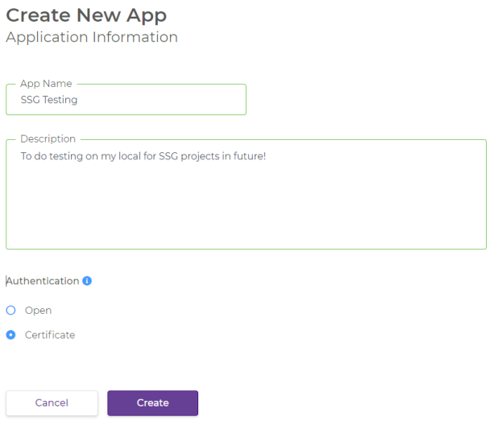

1. Create an Account: https://developer.ssg-wsg.sg/webapp/home

2. Go to Dashboard –> Create New App

    - Authentication: 

        a. Open – Developers will be issued a set of unique Client ID and Client Secret upon creation of an App

        b. Certificate – Mutual authentication and require developers to provide a certificate



3. Go to Dashboard –> Subscriptions –> Add API

4. Run the command below to generate key.pem and cert.pem.

` openssl req -x509 -newkey rsa:4096 -keyout key.pem -out cert.pem -days 365 `

5. Upload the cert.pem to your credentials setting at Dashboard –> App Settings –> Credentials

6. Run the command below to generate PKCS #12 certificate for the .NET application.

` openssl pkcs12 -inkey key.pem -in cert.pem -export -out cert.p12 `

7. Sample C# code:

```
var handler = new HttpClientHandler();
handler.ClientCertificateOptions = ClientCertificateOption.Manual;
handler.SslProtocols = SslProtocols.Tls12;

var cert = File.ReadAllBytes(@"<path_to>\cert.p12");
var x509cert = new X509Certificate2(cert);
handler.ClientCertificates.Add(x509cert);
var httpClient = new HttpClient(handler);

var response = httpClient.GetAsync("https://api.ssg-wsg.sg/skillsFramework/jobRoles/titles?keyword=air").Result;

if (response.StatusCode == HttpStatusCode.OK)
{
    var result = response.Content.ReadAsStringAsync().Result;
}

Console.ReadKey();

```

## References:

- https://developer.ssg-wsg.sg/webapp/home