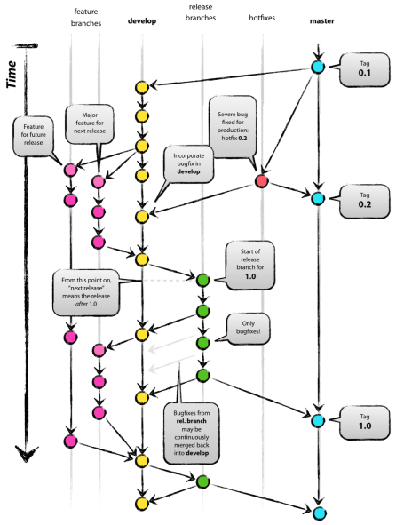

## Git in a nutshell

Git is a distributed version/source control system (VCS). Just like Subversion, Team Foundation Server, Mercurial; each has its pros and cons.

Why we need VCS? It simply because it allows developers to work simultaneously and maintains a history of every version.

## What is Git branching model?

Let's imagine Git branching as a big tree with numerous branches and million of leaves.

Every trees have a **root** as base, develop slowly from a **central branch** to multiple **supporting branches**. Each branch has its own **leaves**.

Now, leaves, from different branches will do its own photosynthesis, bring back **energy** to the central branch and eventually all goes to the root.

Think of Git as a big tree,
- **Root**, as master version
- **Central Branch**, as develop branch
- **Supporting Branches**, as features, releases or hotfixes
- **Leaves**, as the working tasks of project members
- **Energy**, as the finished tasks

when it applies to a project, the central repository will always holds two main branches, the master and develop branch with an infinite lifetime. 

## Branching Strategy

General, we always have remember the rule of thumb:

> **One Task = One Branch**

Branch can be named various example:
- **Master** - Production
- **Develop** - Staging
- **Feature** - New Code
- **Release** - Code release from Develop to Master branch
- **Hotfix** - Emergency fix for Develop and Master branch

It is also good to have **Tagging** for every releases for keeping track of delivered version.

## Pull Request

Pull Request is a software development practice to maintain quality assurance.
It is a practice whereby involved 2 developers and above. 
Developer added 1 or more reviewers do the job for his code. 

The rule of thumb:

> Reviewer should ensure the code is clean, straightforward, easy understandable because nobody want to maintain the 'shitty' code

## In short

There is no fixed strategy developer should follow and practice. 
Among developers themselves should have to adopt a branching pattern that is suitable for his project.
A simplest version of Git model:

## References

- https://nvie.com/posts/a-successful-git-branching-model/
- https://git-scm.com/book/en/v2