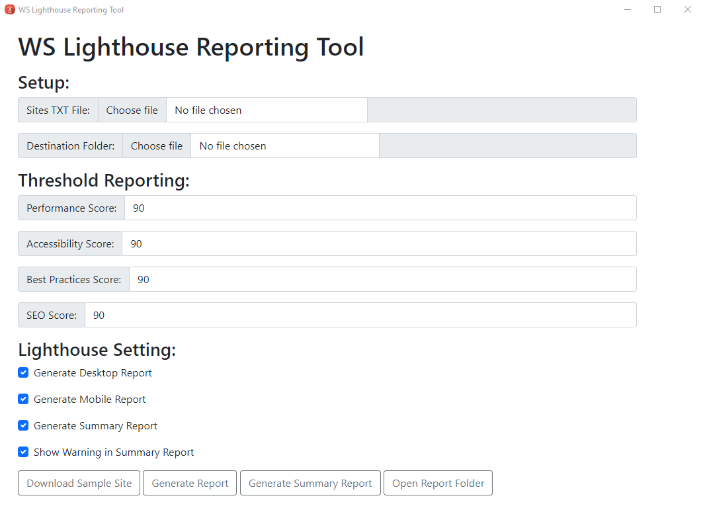
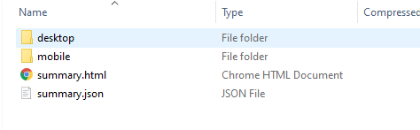
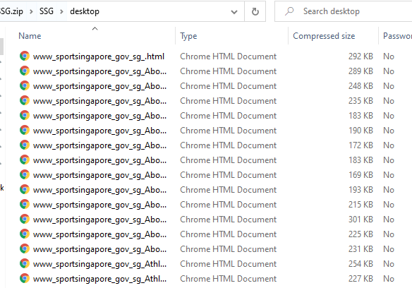
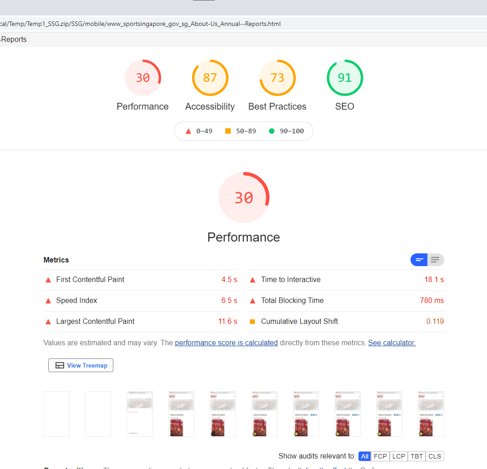
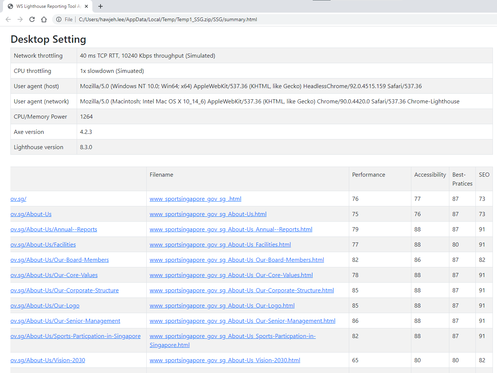
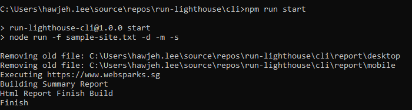

## Problem

- Very tedious to run page by page
- Not stable for each run

## Idea / Proposal

- Run batch lighthouse test using a single tool / command.
- Generate report based on the specified site urls in the loaded txt file

## What is Lighthouse?

Lighthouse is an open source, automated tool by Google.

The aim is to improve quality of web page.
It audits for performance, accessibility, progressive web apps, SEO and more.

We can use the tool with

- **Google Chrome + DevTools**
    - Incognito -> F12 -> Lighthouse
    - Desktop -> All Categories -> Generate Report
    - Mobile -> All Categories -> Generate Report

- **Webpage** - https://developers.google.com/speed/pagespeed/insights/ 
    - share report using json, etc. 

- **Nodejs cli** - https://github.com/GoogleChrome/lighthouse#using-the-node-cli 
    - with command
    ```
        lighthouse https://www.websparks.sg --output json --output html --output-path "C:\Users\hawjeh.lee\Documents\Projects\lighthouse-presentation\cli\www-websparks-sg" --chrome-flags="--no-sandbox --headless --disable-gpu" --preset=desktop --only-categories=accessibility,best-practices,performance,seo,pwa

        lighthouse https://www.websparks.sg --output json --output html --output-path "C:\Users\hawjeh.lee\Documents\Projects\lighthouse-presentation\cli\www-websparks-sg-mobile" --chrome-flags="--no-sandbox --headless --disable-gpu" --only-categories=accessibility,best-practices,performance,seo,pwa
    ```

- **Report Viewer** - https://googlechrome.github.io/lighthouse/viewer/ 

## Porposed Tool - Lighthouse Desktop App

Download and install from here: https://drive.google.com/file/d/1krdWzxDQbDz7vV5SCwY3UGTlSqs6Ba4a/view?usp=sharing



**Setup:**
[ ] Sites TXT File: Select a site txt file, the content should be in this format:

```
https://www.websparks.sg
https://www.websparks.sg/about-us
```

[ ] Destination Folder: Select the destination where the report should be exported 

**Threshold Reporting:**
The settings here is to facilitate the warning in summary report

**Lighthouse Setting:**
[ ] Generate Desktop Report - generate report for desktop browser
[ ] Generate Mobile Report - generate report for mobile browser
[ ] Generate Summary Report - generate overall summary report
[ ] Show Warning in Summary Report - generate warning after compared the generated scores with threshold value

**Output Report:**



List of report for desktop report



Sample mobile report



Sample summary report



## Porposed Tool - CLI

Firstly installed it to global npm package

```
cd ./cli && npm install -g . && npm link
```

then, run command below to get help messages.

```
run-lighthouse -h
```

Example:




Further information: git clone . && read -yourself

Output report same as electron app.


## Tools

- https://github.com/hawjeh/Run-Lighthouse

## References

- https://github.com/GoogleChrome/lighthouse
- https://github.com/mikestead/lighthouse-batch 