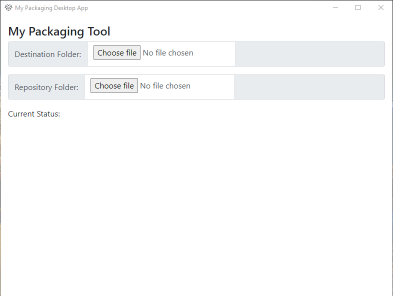
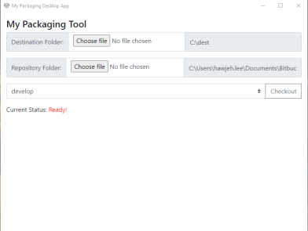
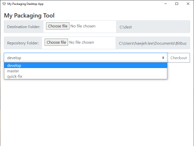
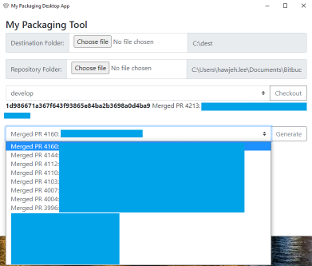

## Purpose of the app

- Quickly pull delta files based on git commit and fetch to destination folder

## Pre-requisite

- Git is installed and added to variable path
- Proper git branching mechanism
- No rubbish in Git repository

## How it works?

1. Run the application

2. Select
    - Destination Folder: Destination for all delta files
    - Repository Folder: Source folder of the git repository

3. Git Branches will auto populate to the dropdown selection when Repository Folder is selected.

4. Click Check Out and it will populate the list of Git Commit from current branch.

5. Click Generate button and it will fetch the delta files to Destination Folder.

6. The app also saved what you have selected. The next time you open the app, it will present your last selection.

## Repository / Exe to download

- https://github.com/hawjeh/PackagingTool
- https://drive.google.com/file/d/1cq26fkmkUsXSVqMqIWoiP0TlY3ZbnaJy/view

## References

- https://www.electronjs.org/
- https://redstapler.co/simple-cpu-monitor-app-electron-tutorial-2020/
- https://www.npmjs.com/package/electron-store