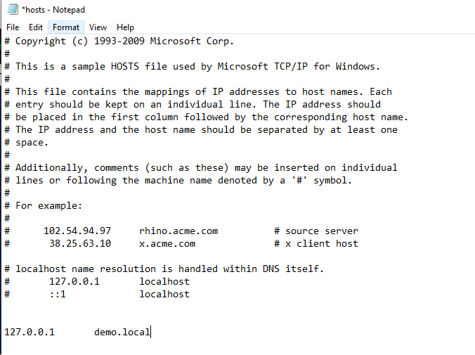
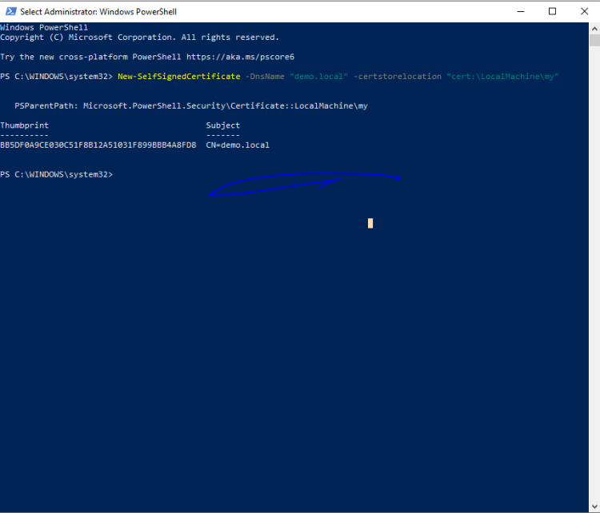
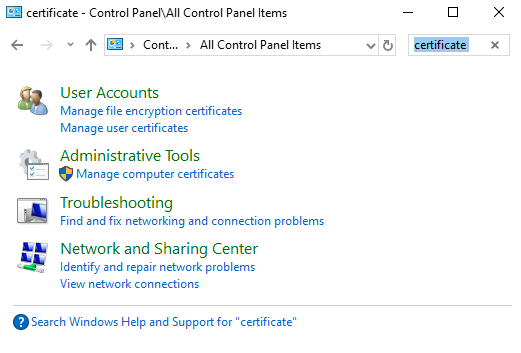
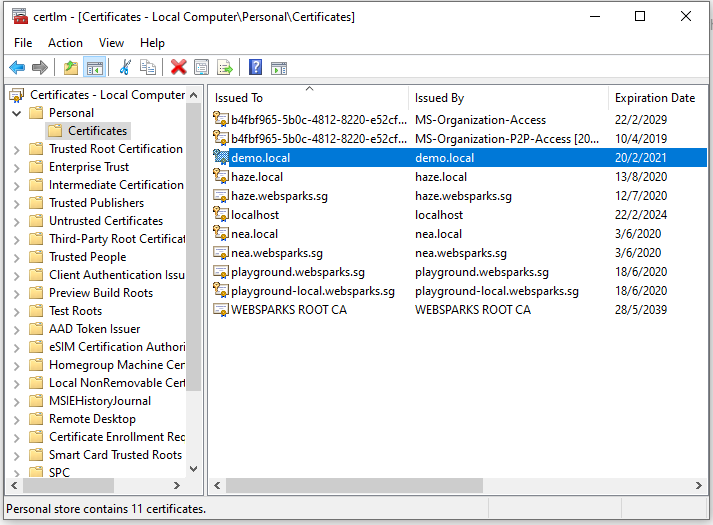
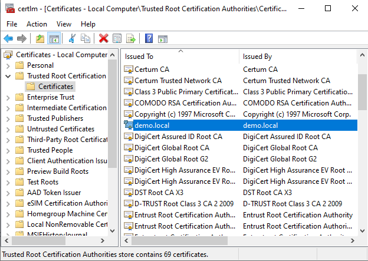
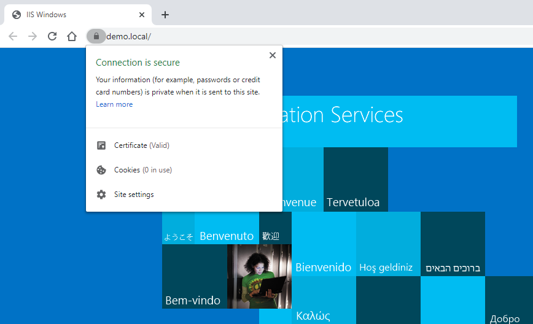

## What we want to achieve?

Host local application with HTTPS in Windows PC / Server

1/ Add DNS name to hosts file at

**C:\Windows\System32\drivers\etc**

2/ Run Windows PowerShell as Administrator

3/ Enter command and will see Self Signed Certificate generated by PowerShell

`New-SelfSignedCertificate -DnsName "<dns_name>" -certstorelocation "cert:\LocalMachine\my"`

4/ Open Windows Run enter **Control Panel** and ok

5/ In Control Panel Explorer, search **certificate** and click **Manage computer certificates**

6/ Navigate to **Certificates – Local Computer > Personal > Certificates** and will see the generated certificate

7/ CTRL + C demo.local, navigate to Local Computer > Trusted Root Certification Authorities > Certificates and CTRL + V

8/ Now open IIS Manager (Window Run + inetmgr), navigate to demo website.

9/ Open Bindings and Add a site binding with
- https – <hosting ip> – 443
- Name the host name
- Tick Require Server Name Indiction
- Select the signed SSL certificate

10/ Lastly, open browser and tadaaaa..! Connection is secure!

## References
- https://www.namecheap.com/support/knowledgebase/article.aspx/9953/38/iis-redirect-http-to-https
- http://woshub.com/how-to-create-self-signed-certificate-with-powershell/