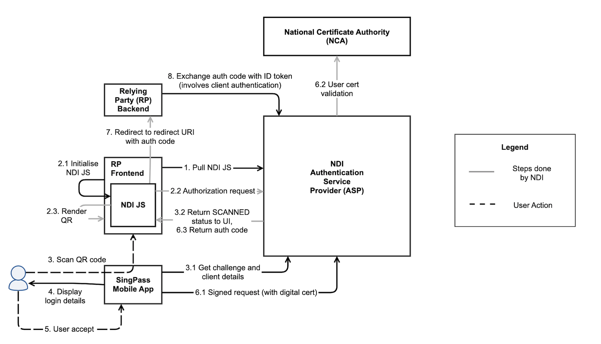
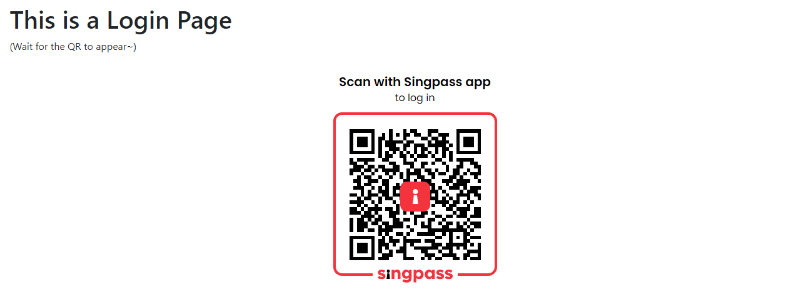
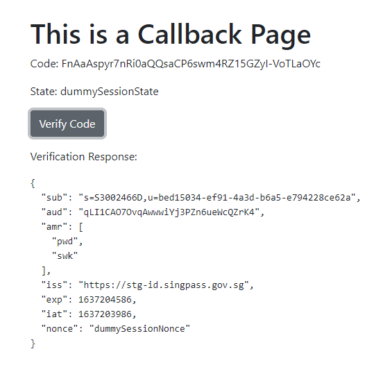

## Login Flow

- High level Frontend / Backend Login: https://api.singpass.gov.sg/assets/api-lib/login/img/actors.png

- OIDC authentication flow: 

- Very detail sequence diagram: https://api.singpass.gov.sg/assets/api-lib/login/img/private-qr.png

## Onboarding

1. Go to Singpass {api} Onboarding, login with CorpPass
    1. Request Integration with Login API
    2. Submit App information

2. Then, the SingPass representative will engage you directly

3. (SingPass rep to provide) Onboarding form
    1. company info
    2. app info
    3. domain name
    4. redirect url
    5. landing url
    6. jwks endpoint url (Check Setup JWKS endpoints)
    7. testing accounts

4. After approval, (SingPass provide credential) you will obtain **TestFlight** accounts & **client_id**

 

## Setup JWKS endpoints

The JSON Web Key Set (JWKS) endpoint is a read-only endpoint that returns the Identity Server's public key set in the JWKS format. 
This contains the signing key(s) that the Relying Party (RP) uses to validate signatures from the Identity Server.

The signing JWK will be used to verify the client assertion JWT provided during /token request, thereby authenticating the client.

Steps to create:

1. Generate private and public key pairs:

    **encryption key, decryption key, signing key and verification key**
    
        # Generate a private key for content decryption
        openssl ecparam -name prime256v1 -genkey -noout -out singpass-decryption-key.pem

        # Generate a public key for content encryption
        openssl ec -in singpass-decryption-key.pem -pubout -out singpass-encryption-key.pem

        # Generate a private key for signature signing key
        openssl ecparam -name prime256v1 -genkey -noout -out singpass-signing-key.pem

        # Generate a public key for signature verification key
        openssl ec -in singpass-signing-key.pem -pubout -out singpass-verification-key.pem

    **(Optional) Encrypt signing and decryption key**

        # encrypt private key use for token decryption
        openssl ec -in singpass-decryption-key.pem -out singpass-decryption-key-encrypted.pem -aes256

        # encrypt private key use to sign the client assertions
        openssl ec -in singpass-signing-key.pem -out singpass-signing-key-encrypted.pem -aes256

2. Using **node-jose** to create keystores, use asKey / asKeyStore - input, form and headers

3. Keystores consists of two public keys: enc (encryption-key) and sig (verification-key).

4. Build an APi and make sure it fulfilled the SingPass requirement to serve the jwks

 

## QR Login Frontend

**Sample step / tutorial**

- Singpass {api} Tutorial 1 
- Singpass {api} Tutorial 2 
- Singpass {api} Tutorial 3 
- Visit here: https://stg-id.singpass.gov.sg/docs/embedded-auth/js
- Sample Code: https://stg-id.singpass.gov.sg/docs/embedded-auth/js#_sample_html_with_ndi_embedded_auth_js
- Receive callback with code & state

**NOTE**

- Setup TestFlight app (It doesnt work together with actual SingPass app, hence, you have to install at backup phone)

- Follow the tutorial, specify clientId, redirectUri, scope, responseType

- Then, you shall able to see the QR code and scan it using TestFlight

- Lastly, it will callback to the redirect URL you provided

 

## Relying Party Backend

**Sample step / tutorial**

- Build Client Assertion
    - Build a JWT with required payload and sign with private key - signing-key

- Build API to receive code and exchange for JWE (access_token, token_type and id_token)
    - HTTP POST to token_endpoint with required body and headers

- Decrypt JWE and get a JWT token
    - Decrypt JWE with private key - decryption-key
    - Will retrieve another encrypted JWT token

- Verify encrypted JWT token
    -Verify the decrypted JWT token with Singpass public key

- Lastly, it will return payload with sub (IC id and U id)

 

## Sample response screen

Login Screen

Response / Verify Screen

 

## Add on feature

- How it works? Scenario below:

    - I want to login using singpass
    - Redirect to <provider>/login?callback=<origin_end_point>&nonce=<nonce>
    - Scan QR code and authenticate my user
    - Provider response to origin end point with base64 endcoded payload + nonce
    - Origin endpoint should verify the nonce be matched with request

- Demo: Check Demo Video

- Demo in App

	- Repository: https://github.com/hawjeh/SitefinityWidgetCollection
    - Setup widget with login role, service and callback url
    - A nonce cookie generated on load - expired in 20 mins
    - Click login button request to service url with callback url & nonce (Format: `https://<service_url>?callback=<callback_url>&nonce=<nonce>`)
    - Authentication at service site
    - Callback from service site (Format: `https://<domain>/<callback_path>?s=<encoded_sid>&u=<encoded_uid>&nonce=<nonce>`)
    - Verify callback nonce with cookie value
    - Create user if not exists; login user if exists
    - Furthermore, check the demo video for app integration

## Futher Enhancements

- Integrate with myInfo service

 

## References

- https://mkjwk.org/
- https://github.com/cisco/node-jose
- https://gist.github.com/leeliwei930/f35d5ea70531765e0bdc6c8c6fd2665d
    - https://techrino930.medium.com/integrating-singpass-login-api-with-laravel-socialite-provider-part-1-onboarding-setup-210d7fa0f31f
    - https://techrino930.medium.com/integrating-singpass-login-api-with-laravel-socialite-provider-part-2-writing-socialite-provider-724302de03c1
    - https://techrino930.medium.com/integrating-singpass-login-api-with-laravel-socialite-provider-the-last-part-frontend-de362da9f979
- https://www.youtube.com/playlist?list=PLwUcMsSZ5FPQPApNCWpaOqhac1gWykjtG

## Repository

- https://github.com/hawjeh/SingPassConnector (Private repo)

## Demo Video

- https://drive.google.com/file/d/1hCNnev4rIIiO3xuG-8MCYNXQJE8hhizK/view?usp=sharing
- App Integration: https://drive.google.com/file/d/1eqRW_D766GZLZgx6kzVbNtOW3J5CrP-T/view