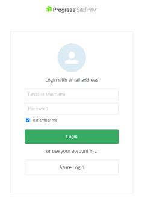
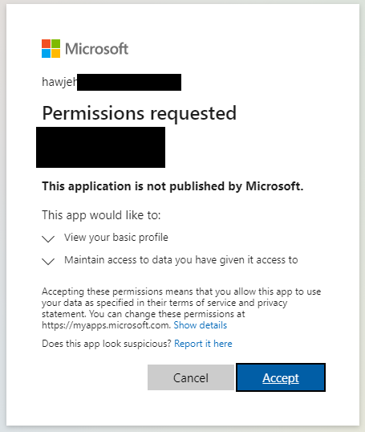
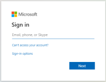
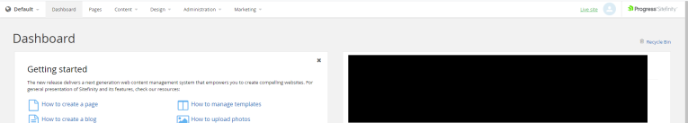
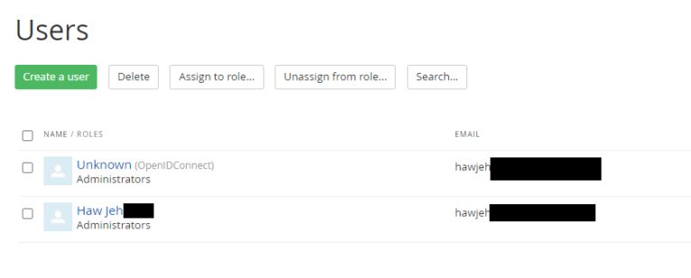
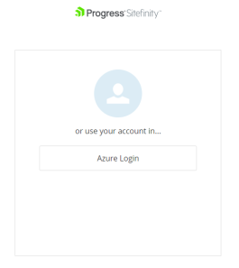

## Azure AD Setup

1. Go to you Azure Active Directory → App Registrations → New Registration

2. Give a name to the application, you can leave the Redirect URI as blank now. Then click Register.

3. Go to Authentication Tab → Add a platform → Web

4. Redirect URIs: http://<[Sitefinity Instance]>/Sitefinity/Authenticate/OpenID/signin-custom

5. Select the tokens you would like to be issued by the authorization endpoint: Check ID Tokens

## Sitefinity Setup

1. Spin up (If you haven’t) and run the Sitefinity Instance

2. Login to Sitefinity backend → Go to Administration → Advanced → Authentication → SecurityTokenService → AuthenticationProviders → OpenIDConnect

3. Do the following settings:

|Setting|Key|
|--- |--- |
|ClientID|<[Azure AD App – Application (client) ID]>|
|Response type|id_token|
|Allowed scopes|openid profile email|
|Authority|https://login.microsoftonline.com/<[Azure AD App Directory (tenant) ID]>/v2.0|
|Metadata address|https://login.microsoftonline.com//v2.0/.well-known/openid-configuration|
|Redirect URI|http://<[Sitefinity instance]>/Sitefinity/Authenticate/OpenID/signin-custom|
|Post logout redirect URI|http://<[Sitefinity instance]>|
|Title|Azure AD Login|
|Enabled|True|
|Auto assigned roles|Administrators|
|Require email claim from this provider|False|

4. Restart Sitefinity

5. Verification
    a. Visit http://<[Sitefinity instance]>/Sitefinity → Click Azure Login
        

    b. It will prompt you a permission request for first time login, simply press Accept.
        

    c. It will prompt for your username + password. Fulfill it and it will route you back to Sitefinity dashboard
        
        

    d. Then go to Administration → Users, you will see an unknown user and a default user while both having same email address.
        

    e. It is working!

## Further Enhancement
- Intercept AzureAD callback response, and create necessary users with proper profile
- Hide the default login method completely
    1. Create a file under /Content/Pages/login.html
    2. Comment unnecessary blocks: login.html (github.com)
    3. Restart Sitefinity, and you will see only Azure Login button
    4. Consider to write a script to redirect on page load

## References

- https://knowledgebase.progress.com/articles/Knowledge/Configure-Sitefinity-with-Azure-AD-B2C-Authentication?r=203&ui-knowledge-components-aura-actions.KnowledgeArticleVersionCreateDraftFromOnlineAction.createDraftFromOnlineArticle=1
- https://www.progress.com/documentation/sitefinity-cms/administration-configure-the-openid-connect-provider
- https://knowledgebase.progress.com/articles/Article/How-to-hide-the-external-Identity-providers-buttons-from-the-backend-login-page

