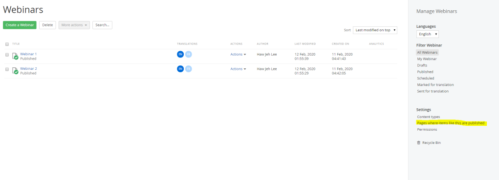
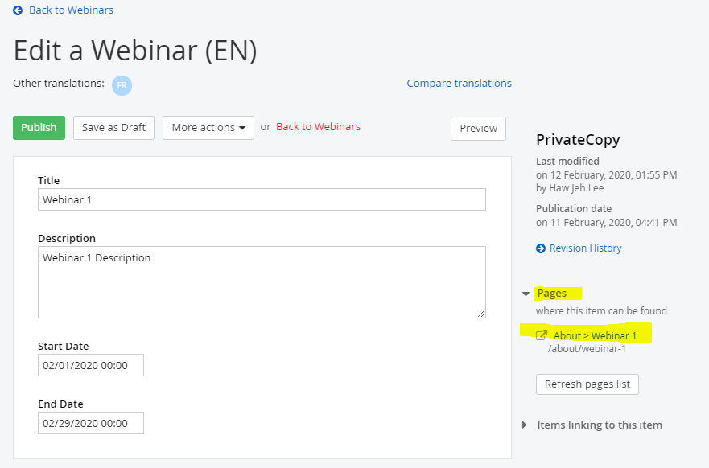

In this sample, I have implemented
- IContentLocatableView
- IHasCacheDependency (SubscribeCacheDependency)
- HandleUnknownAction

## ContentBaseController and ContentModelBase 

It has the main functionality for constructing all the out-of-the-box SEO properties, supporting listing and detail pages. When this class is implemented, you will be able to call the **InitializeMetadataDetailsViewBag** method, pass in it the item that is currently being displayed and based on the item and the SEO configurations of the site, Sitefinity will automatically create OG and normal SEO properties.
Sitefinity GitHub

**To verify IContentLocatableView**, we have to 
- Remove the custom widget
- Publish page
- Add the custom widget
- Publish page

Then go to the content type page, either

1/ 

2/

## IHasCacheDependency

The implementation of this interface will provide proper cache invalidation for the respective content type, in the custom widget. 

When developing your own user or custom widget, to invalidate the cache, you need to implement the appropriate cache dependencies in order. 

This way, when you create or modify a content item, the widget cache is invalidated in order to reflect the latest changes in the content. 

For example, if you place an MVC widget displaying news items on the page. When you change the news content, the cache of the page with the widget is invalidated and the controller action is not called.

## HandleUnknownAction

With this method, the Controller should mark the Url Parameters as resolved, so the system knows that this Url and parameters will be handled and this is not a 404 Not Found.

**To verify HandleUnknownAction**, we have to

- Visit the url where the custom widget is installed
- Go to the path where the custom widget does not support.

Eg. Install custom widget at About page, have

- Have /index method and HandleUnknownAction only
- Visit /Detail of About page, it will route to the page specified at HandleUnknownAction

## Idea after implemented recommendation above

When editor publish a page with the custom widget installed. IContentLocatble’s GetLocations will notify Sitefinity to register the URL where the content type will be display to public.

Implementing by IHasCacheDependency / SubscribeCacheDependency() at custom widget’s (controller) code. It will invalidate cache when a new content type is created.

Create a HandleUnknownAction to route 404 to a meaningful page.

## Documentation / References:

- https://knowledgebase.progress.com/articles/Article/Best-practices-when-implementing-custom-MVC-Widgets
- https://www.progress.com/documentation/sitefinity-cms/for-developers-register-content-location-with-your-custom-widgets
- https://www.progress.com/documentation/sitefinity-cms/implement-cache-dependencies
- https://knowledgebase.progress.com/articles/Article/how-to-implement-icontentlocatableview-for-custom-widgets

## Recommendation
The recommended solution is extending the view of content type generated
(auto generated when a new custom module is created).
By extending the view, all Sitefinity best practices are inherited by default.
eg. (Refer to bootstrap / boockstrap4 folder)
/ImageGallery
  /List.MyGallery.cshtml
  /Detail.MyGallery.cshtml

## My Sample Code

- https://gist.github.com/hawjeh/48cf6c96f2fc734105a188af8dbdaeb0