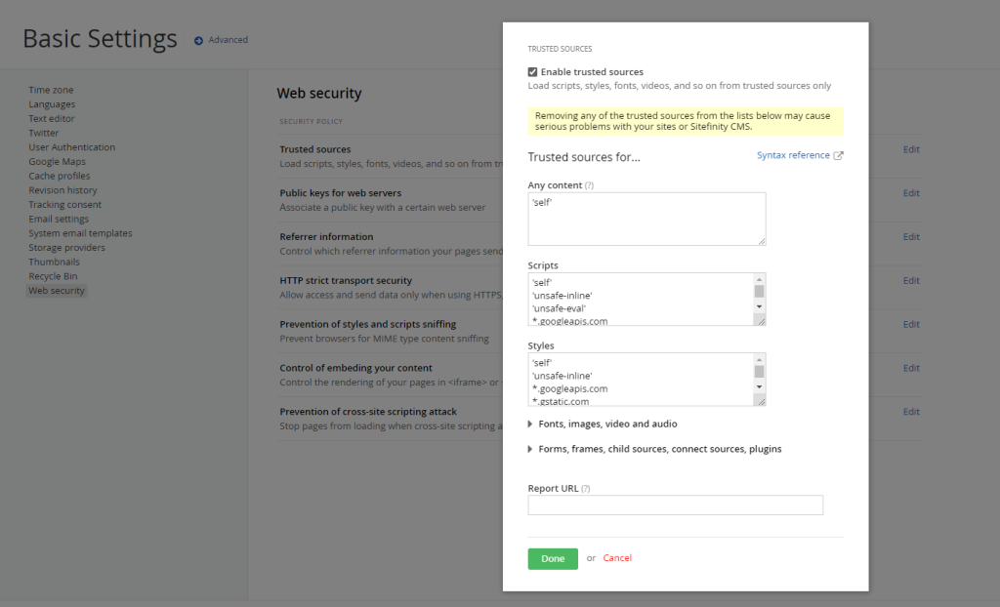
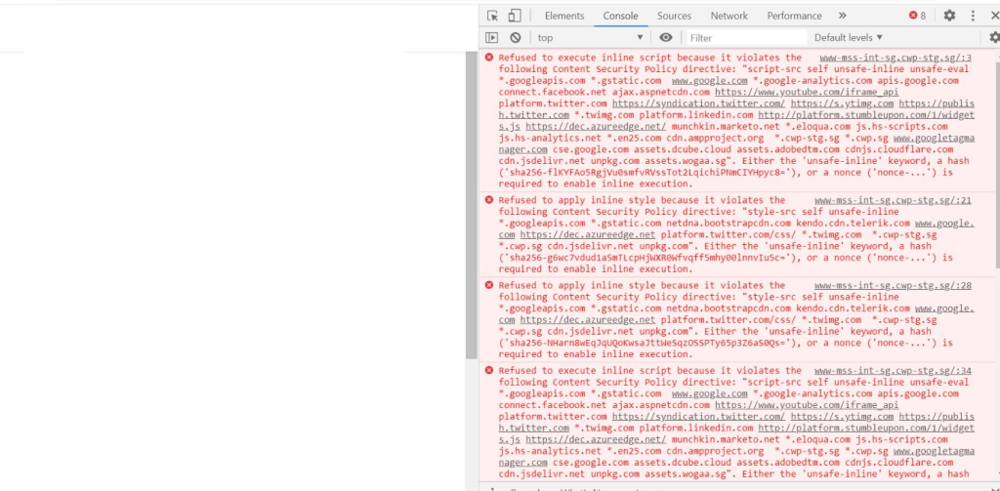
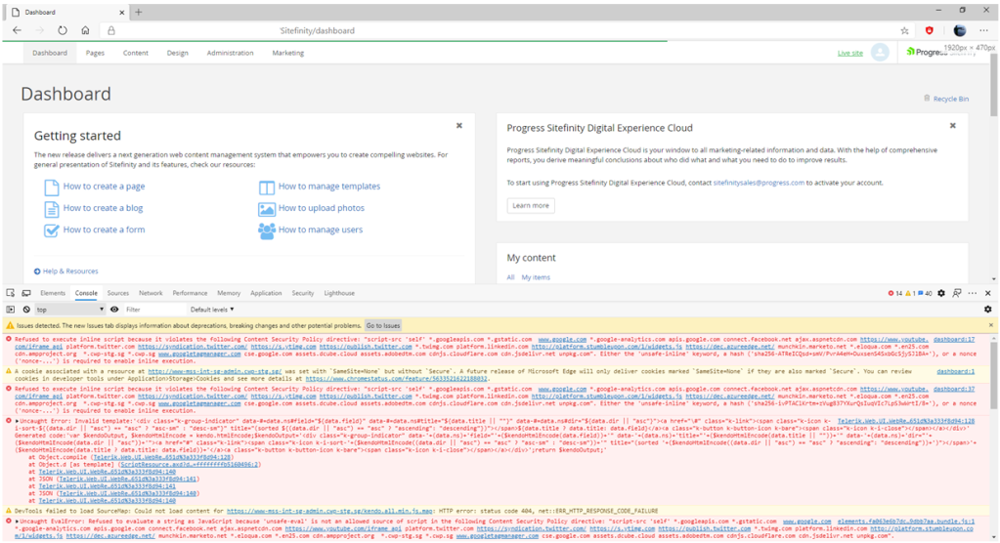

## Where to find the setting?

There is an option to update CSP rule in backend dashboard setting from Sitefinity v11 onwards, under
- /Sitefinity/Administration/Settings/Basic/WebSecurityBasicSettings

Please **avoid remove** the default CSP rule as it has high chance you will break Sitefinity frontend / backend unwillingly.

Example front-end broken:

Example back-end broken:

## How to fix it?

<a href="https://drive.google.com/file/d/1Kk4TAXyAMZaoMv_F51XXKZZ6ihKeZF2x/view" target="_blank" rel="noopenner opreferrer">Download</a>

Download this zip and amend the script (to your desired CSP rules).
Then, execute the script in your database instance.

## References

- https://knowledgebase.progress.com/articles/Article/content-security-policy-http-header