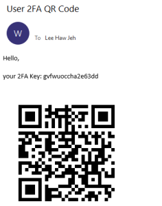

Only tested in V12.x

## Idea in general

1. Create a new user in Sitefinity
2. User receive QR code and setup in Authenticator
3. User login with username & password -> Prompt for 2FA code
4. Login Successful!


## Sample Code

- https://github.com/hawjeh/Sitefinity2fa

# Steps

1. Go to 
```
/Sitefinity/Administration/ProfileTypes -> Basic Profile
Add a custom field – AuthCode (ShortText) in user profile
```


2. Create a new user, wait for email and setup the Authenticator in your mobile.



3. Go to /Sitefinity/Administration/Settings/Advanced

    a. Authentication -> Authentication protocol -> set to SimpleWebToken

    b. Security -> RelyingParties -> Add a new record, and state the realm=”<host>”, key can be exactly same as the default localhost’s key.
    
    c. Security -> SecurityTokenIssuers -> Add a new record, and state the realm=”<host>”, key can be exactly same as the default localhost’s key.


4. Update wsFederation at web.config

```
 <system.identityModel.services>
    <federationConfiguration>
      <wsFederation passiveRedirectEnabled="true" issuer="http://<host>/wsauth/authenticate/swt" realm="http://<host>" requireHttps="false" />
      <cookieHandler requireSsl="false" />
    </federationConfiguration>
  </system.identityModel.services>
```

5. Restart Sitefinity.

6. Go to /Sitefinity, it will route you to the sample login screen


## Further enhancements:

1. Make fields configurable, such as:
    – custom field name
    – email template

2. Make it work in all Sitefinity version (Currently tested in v12.2)

## References

- https://github.com/timw255/timw255.Sitefinity.TwoFactorAuthentication
- https://github.com/rickbassham/two-factor
- https://www.codeproject.com/Articles/403355/Implementing-Two-Factor-Authentication-in-ASP-NET
- https://knowledgebase.progress.com/articles/Article/Modifying-Sitefinitys-backend-login-page