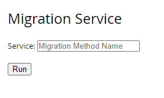

## Background Story

We have setup a content type with PostalCode in Number type.

Number in layman term means 0 ~ 9, however it is different in coding / Sitefinity; it means a decimal type in database column which is not logical to start with 0. 

Therefore, when user create a new content, they could not enter Postal code start with 0 (we later founed out that some area of Singapore postal codes start with zero (0)).

Lastly, we have to find a workaround / alternative to fix our mistake in the beginning.

## Steps to counter this issue

1. Firstly, backup the existing content. It is to create a backup for any migration failure and have incident recovery if the plan failed.

    - *Why?* It involved database schema changes (update in table columns) and it has risk.

2. Create a new field in ShortText type named PostalCodes.

    - *Why?* Sitefinity ShortText is a nvarchar(255) in database, so it will accept value start with 0.

3. Rename the label of current PostalCode field to Postal Code (Old).

    - *Why?* To reduce confusion between both Postal Code.

4. Run the field migration tool.

    - *How?* Explain in next section.

5. Check and verify the migrated data

6. Rearrange the dashboard navigation, front-end, listing and new/edit screen.

    - No idea why the content type field arrangement in the front-end view will go off if there is changes.

7. Lastly, delete the old PostalCode.

## Migration Tool

It is a very simple custom widget that consist of a input text box, a submit button and response message paragraph. 

It is also set to allowed only Administrators to access the function. 

To understand the context and make this works, we have study and decided to make use of c# Reflection technology. 

The idea is to make use of C# Reflection technology to map the method name in a generic class. Then execute the function matched.

  

Lets key in some text and press submit, the result scenarios are below:

  

<b>*If the method name is mismatched.*</b>

- It will return with error message: “<method name> is an inappropriate method name.“. Meaning the method name cannot be found in the class.

  

<b>*If the method name is matched. However, you have yet to setup the new field.*</b>

- It will return with error message: “Please setup the new field and run the migration tool again”. Meaning the method name is found but you have not setup the new field.

  

<b>*If the method name is matched.*</b>

- It will return with a list of migrated content type.

  

TADAAA! Migration will be executed and old PostalCode will be copied to new PostalCode within a few seconds.

## Outcomes

- Reflection technology learnt.
- Reusable for any other field migration.

## Further Enhancement

- Include the migrated the content type, source & destination field as part of the HTTP POST request
- Invoke the method with content type, source & destination field

## Code Snippets

- https://gist.github.com/hawjeh/175610ad762f6d7e05bebc753fd9aced

## References

- https://docs.microsoft.com/en-us/dotnet/csharp/programming-guide/concepts/reflection
- https://knowledgebase.progress.com/articles/Knowledge/changing-the-type-of-a-custom-field

