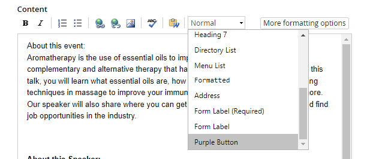
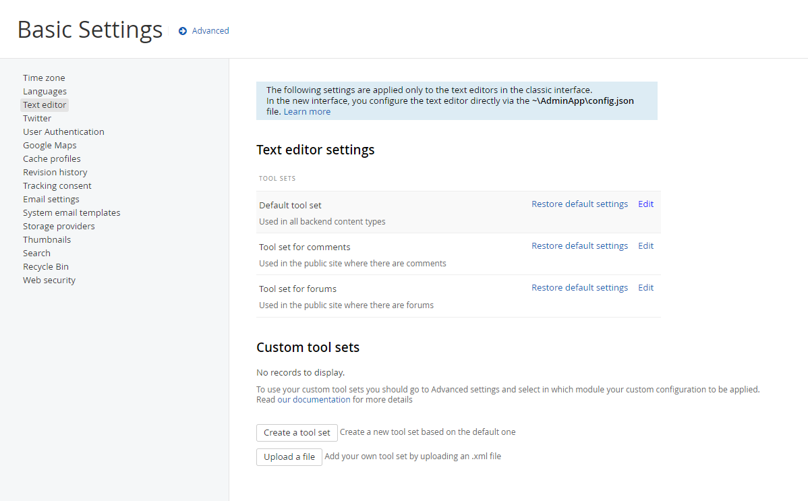
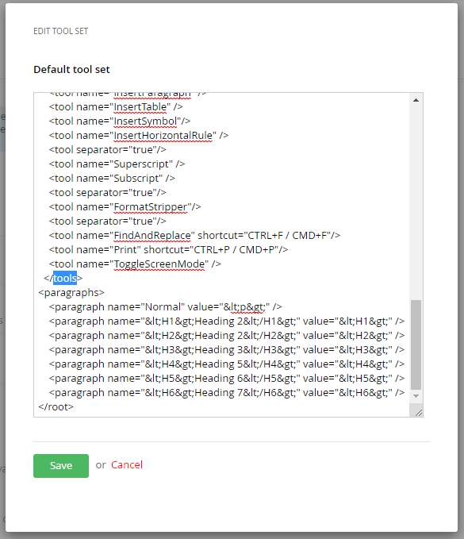
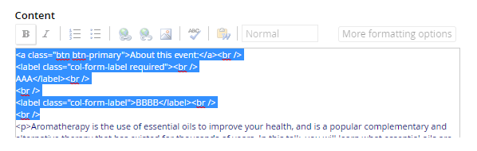

## Intro

Add text format to existing paragraph format list.

## Expected Result




## Text Editor Setting

1. Access to /Sitefinity/Administration/Settings/Basic/TextEditor:



2. Then we add the line of the code before end of </root>:



<br><br>

```
#Base
 
<paragraphs>
    <paragraph name="Normal" value="&lt;p&gt;" />
    <paragraph name="&lt;H1&gt;Heading 2&lt;/H1&gt;" value="&lt;H1&gt;" />
    <paragraph name="&lt;H2&gt;Heading 2&lt;/H2&gt;" value="&lt;H2&gt;" />
    <paragraph name="&lt;H3&gt;Heading 3&lt;/H3&gt;" value="&lt;H3&gt;" />
    <paragraph name="&lt;H4&gt;Heading 5&lt;/H4&gt;" value="&lt;H4&gt;" />
    <paragraph name="&lt;H5&gt;Heading 6&lt;/H5&gt;" value="&lt;H5&gt;" />
    <paragraph name="&lt;H6&gt;Heading 7&lt;/H6&gt;" value="&lt;H6&gt;" />
    <paragraph name="&lt;dir&gt;Directory List&lt;/dir&gt;" value="&lt;dir&gt;"/>
    <paragraph name="&lt;menu&gt;Menu List&lt;/menu&gt;" value="&lt;menu&gt;"/>
    <paragraph name="&lt;pre&gt;Formatted&lt;/pre&gt;" value="&lt;pre&gt;"/>
    <paragraph name="&lt;address&gt;Address&lt;/address&gt;" value="&lt;address&gt;"/>
</paragraphs>

```

```
#Added new paragraph

<paragraphs>
    <paragraph name="Normal" value="&lt;p&gt;" />
    <paragraph name="&lt;H1&gt;Heading 2&lt;/H1&gt;" value="&lt;H1&gt;" />
    <paragraph name="&lt;H2&gt;Heading 2&lt;/H2&gt;" value="&lt;H2&gt;" />
    <paragraph name="&lt;H3&gt;Heading 3&lt;/H3&gt;" value="&lt;H3&gt;" />
    <paragraph name="&lt;H4&gt;Heading 5&lt;/H4&gt;" value="&lt;H4&gt;" />
    <paragraph name="&lt;H5&gt;Heading 6&lt;/H5&gt;" value="&lt;H5&gt;" />
    <paragraph name="&lt;H6&gt;Heading 7&lt;/H6&gt;" value="&lt;H6&gt;" />
    <paragraph name="&lt;dir&gt;Directory List&lt;/dir&gt;" value="&lt;dir&gt;"/>
    <paragraph name="&lt;menu&gt;Menu List&lt;/menu&gt;" value="&lt;menu&gt;"/>
    <paragraph name="&lt;pre&gt;Formatted&lt;/pre&gt;" value="&lt;pre&gt;"/>
    <paragraph name="&lt;address&gt;Address&lt;/address&gt;" value="&lt;address&gt;"/>
    <paragraph name="Form Label (Required)" value="&lt;label class=&quot;col-form-label required&quot;&gt;"/>
    <paragraph name="Form Label" value="&lt;label class=&quot;col-form-label&quot;&gt;"/>
    <paragraph name="Purple Button" value="&lt;a href=&quot;#&quot; class=&quot;btn btn-primary&quot; type=&quot;submit&quot;&gt;"/>
</paragraphs>

```

<br><br>

3. Finally




## References

- https://demos.telerik.com/aspnet-ajax/editor/examples/formatblock/defaultvb.aspx