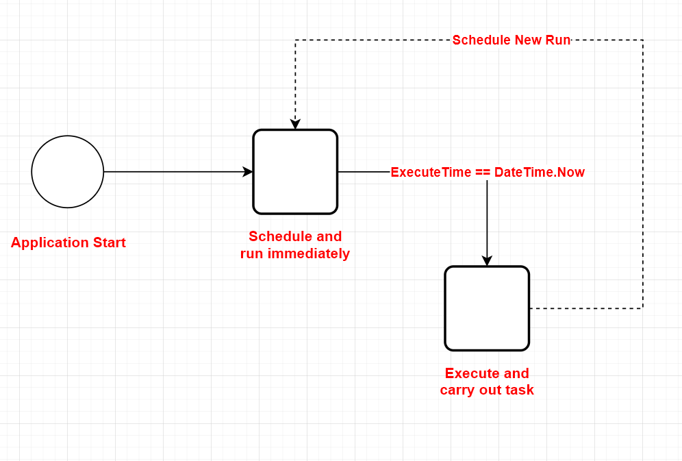
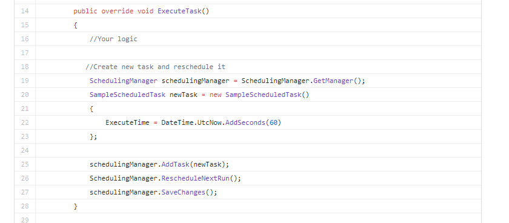
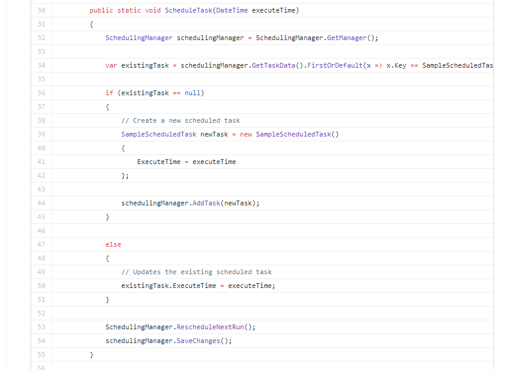
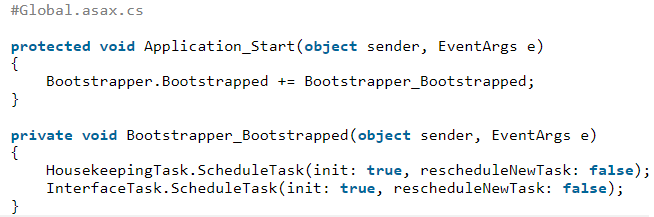

## Intro

Scheduled tasks in Sitefinity CMS are objects that can execute a predefined set of operation at a particular point in time. 

You can use scheduled task… (read from reference..)

## Expected Workflow

1. Schedule a task during application start
2. Trigger ExecuteTask()
3. Run ScheduleTask()
4. Repeat 2-3

## Schedule Task Code

There are two important method,

- ExecuteTask() -> It will trigger when date time now = execute_time

- ScheduleTask() -> To schedule new task

Then we rewrite the code:

## Schedule Task Table

**dbo.sf_scheduled_tasks**

| Columns       |
|---------------|
| task_name     |
| ky            |
| is_running    |
| execute_time  |
| schedule_data |

## Conclusion

Then we try to put debug point at ScheduleTask() method and got conclusion below.

**Steps**

Then check ScheduleTask() method,

1. First time scall ScheduleTask(), the existingTask is null
2. ExecuteTask() triggered
3. Call ScheduleTask(), existingTask is not null
4. Set a new execute time –> existingTask.ExecuteTime = executeTime;
5. call RescheduleNextRun() and SaveChange()

**Findings:**
- Notice during the 3) step, the existing task is_running is true.
- Notice right after 5) step, there will be two records in sf_scheduled_tasks table. one with is_running = true, one with is_running = false
- About 10 seconds later, the record with is_running = true is gone

Then we got the conclusion on the columns as below:

| Columns       | Description                                                     |
|---------------|-----------------------------------------------------------------|
| task_name     | Name of class where implement the abstract class ScheduledTask  |
| ky            | Task key                                                        |
| is_running    | True when task is running; False when task has yet to run       |
| execute_time  | Task scheduled timing (next run)                                |
| schedule_data | To store cron task config (not applicable in this investigate)  |

## References

- https://www.progress.com/documentation/sitefinity-cms/for-developers-scheduled-tasks