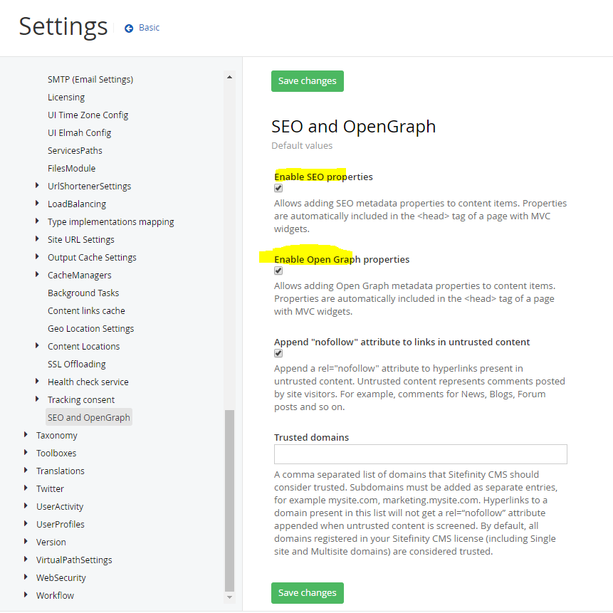
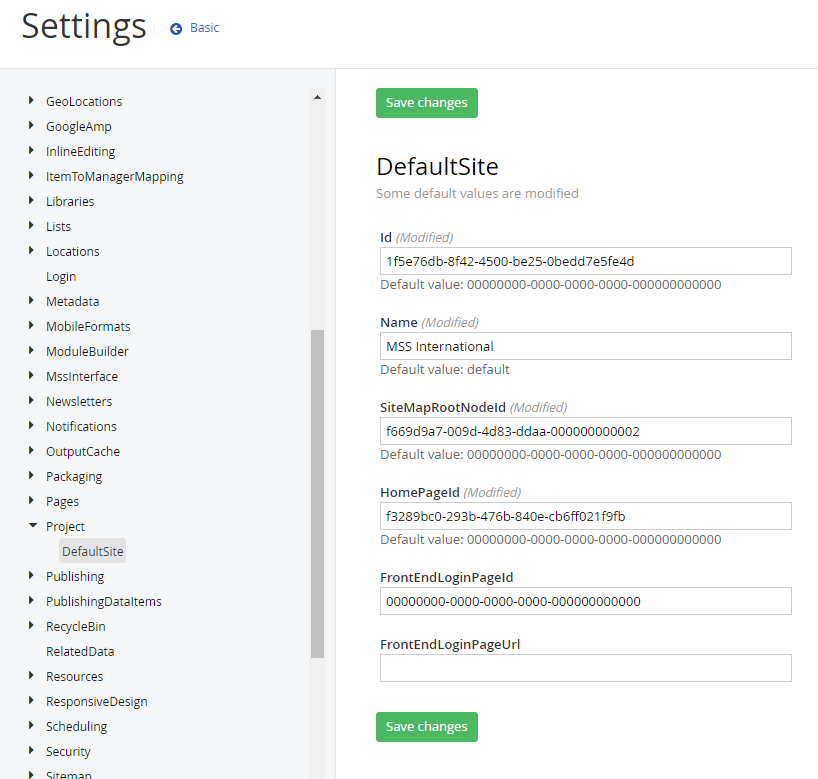
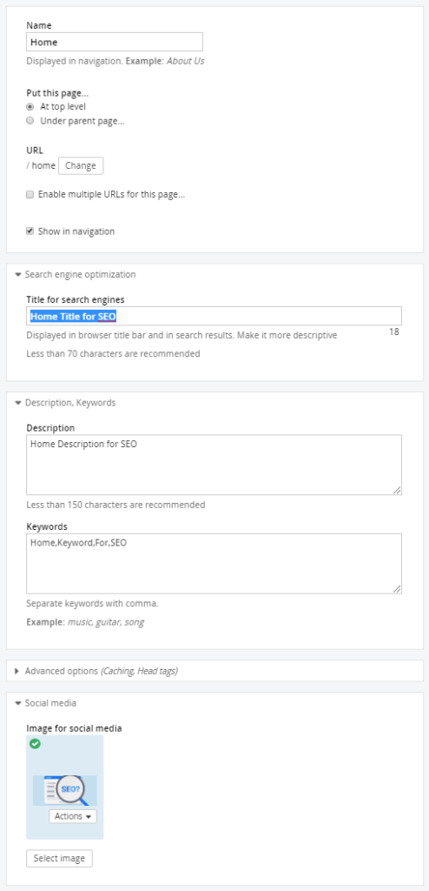
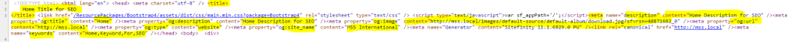

My testing Sitefinity version: V11.1

## Open graph Setting

Setting → Advanced → System → SEO and OpenGraph

- Must enable both SEO and Open Graph Properties

## Site Name Setting

Setting → Advanced → Project → DefaultSite

- Customize Name for the site

## Page Setting

Pre-requisite: Create a CustomField: Image for social media **(OpenGraphImage)**

## Result

## Result Mapping

| No      | Title                   | Title for search engines  |
| ------- | ----------------------- | ------------------------- |
| 1       | Meta – Description      | Description               |
| 2       | Meta – og:title         | Page Name                 |
| 3       | Meta – og:description   | Description               |
| 4       | Meta – og:image         | Image for social media    |
| 5       | Meta – og:url           | Page url                  |
| 6       | Meta – og:type          | website                   |
| 7       | Meta – og:site_name     | Site Name Setting         |
| 8       | Meta – keywords         | Keywords                  |

## Result Mapping

- https://www.progress.com/documentation/sitefinity-cms/association-of-custom-fields-and-open-graph-meta-properties