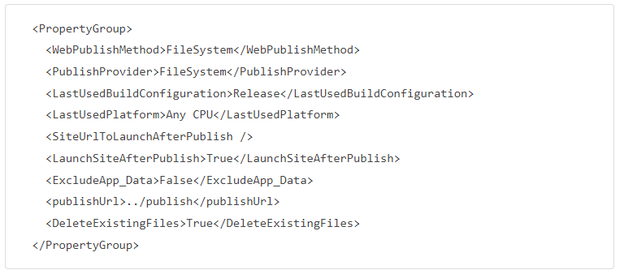
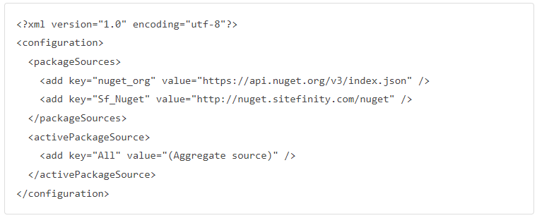
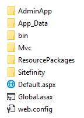

## Important notes
- Only include files and deploy to solution
- Project should be using nuget feed
- Project should have have Debug and Release mode

## Project Structure
- /<root>
- /Nuget.config
- /DemoServer
- /DataConfig.config
- /Sitefinity.lic
- /packages
- /(nuget packages)
- /SitefinityWebApp
- /(sitefinity related files)
- /bin
- /Properties/PublishProfiles/PublishProfile.pubxml
- /SitefinityWebApp.csproj

## Setting
### DemoServer Folder
- DataConfig.config – include ConnectionString of database server
- Sitefinity.lic

### SitefinityWebApp Release mode setting
- DebugType: None
- Optimize: True
- AllowedReferenceRelatedFileExtensions: –

### SitefinityWebApp Publish Profile
- Web Publish Method: FileSystem
- Target Location: ../publish
- Delete Existing File: True
- Configuration: Release
- Exclude App Data: false

### Nuget.config

### What to expect on the local /publish folder?

It is building project with Publish mode

With the published files, we can always try to host on local IIS to make sure everything is fine before configure the CICD pipeline.

And yes, basically what we see on local /publish folder will be expected to deploy to destination server with CICD pipeline.

Part 2 will discuss further the CICD pipeline configuration