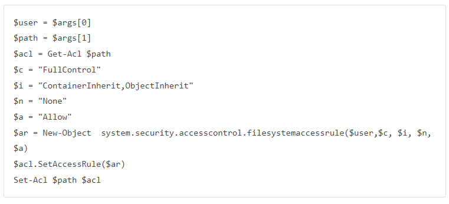
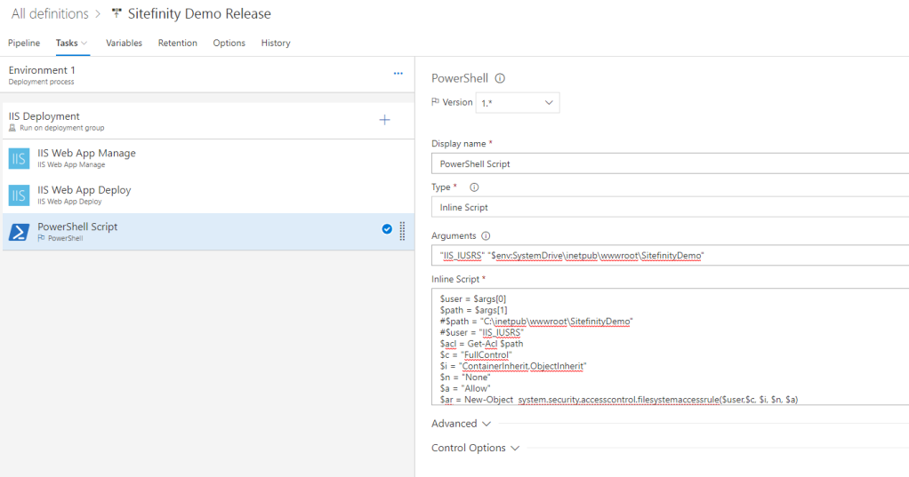

## Important Notes
- Planning before execution
- Clearly understand each command / argument
- Must confirm input path are correct (no turn back if CD server erase all files)

## Strategy

1/ Developer push code to TFS and it will send signal to CI server if it is a watching branch (in our case the branch is develop-int).

2/ CI server will carry on tasks, continue every next task when current task has no error. Finally, it will publish an artifact that is ready for CD server.

3/ CI server will trigger CD to start working and finally deploy the published artifacts if everything go smooth.

## Create a Deployment Group

1/ Create a Deployment Group

2/ Run script at deploy server

## My CD Pipeline Setting

1/ Create a new release template with “IIS Website and SQL Database Deployment”

2/ Add an artifact
– Source Type: Build
– Default version: Latest from specific branch

3/ Add a trigger for artifact
– Enable: true
– Build branch: master

4/ Add a trigger for environment
– Artifact filters: Enable
– Add: Sitefinity Demo, master branch

5/ Edit Deployment Group phase
– Select Deployment Group

6/ Update IIS Web App Manage
– Configuration Type: IIS Website
– Action: Create Or Update
– Website name: SitefinityDemo
– Add Binding: port:80
– Physical Path: %SystemDrive%\inetpub\wwwroot\SitefinityDemo
– … (have proper Website setting)

7/ Edit IIS Web App Deploy
– Select Package or Folder: $(System.DefaultWorkingDirectory)/Sitefinity Demo/drop
– Remove Additional Files at Destination: true
– Take App Offline: true

8/ Add a inline PowerShell Script
– Arguments: 'IIS_IUSRS' '$env:SystemDrive\inetpub\wwwroot\SitefinityDemo'
– Inline Script:

9/ And you are done!

